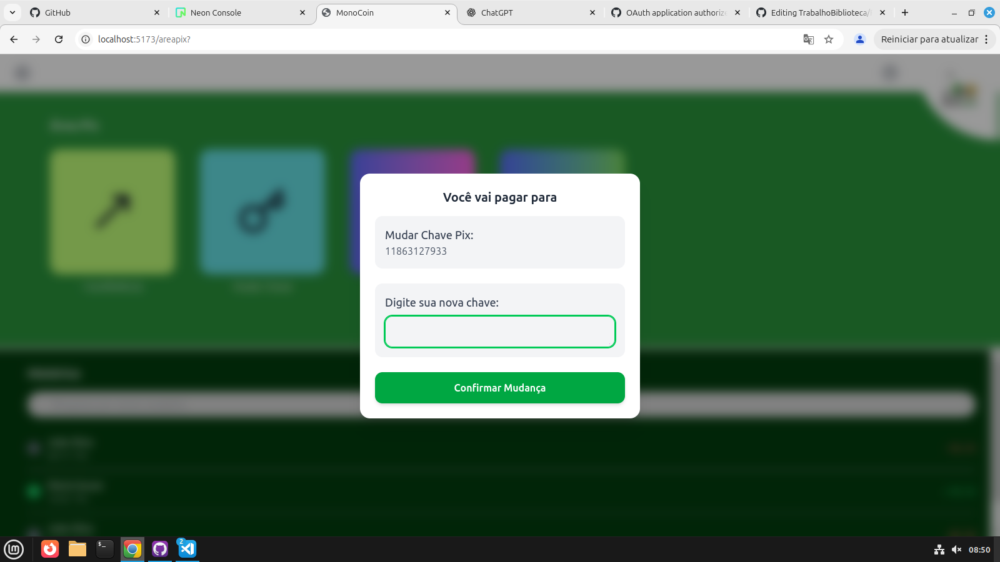

# Aplicação Monocoin

## 🚀 Descrição do Projeto
Frontend e Backend do nosso banco **"MonoCoin"**, com uso das ferramentas Javascript **React Vite**, **React-Router**, **Node.js**, **Fastify** e **NeonDB** como banco de dados

## 🎯 Objetivo do Projeto
O objetivo é oferecer uma experiência intuitiva e segura para operações financeiras, incluindo gerenciamento de contas, transações Pix, autenticação e visualização de histórico, garantindo desempenho, escalabilidade e organização no fluxo entre cliente e servidor.


## 💻 Tecnologias Utilizadas
- 
- 
- 
  
- 
- 
- 
- 

## 📊 Status do Projeto
- [ ] 🚫 Não Feito
- [x] 🔄 Em Andamento
- [ ] ✅ Concluído

## 🛠️ Instalação e Execução
- Clone o repositório e abra um terminal nele
```
git clone https://github.com/saraqwe123/PIProjeto.git
```
- Instale suas dependências
```
cd Backend
npm i

cd ../Frontend
npm i

cd ..
npm i
```

- Execute o Site na raiz do projeto (Ele se localizará em http://localhost:5173/)
```
npm start
```

## ˖°📷༘ Exemplo de uso


## 👥 Integrantes
| Integrante       | GitHub |
|------------------|---------|
| **Sara Guaiume** | [saraqwe123](https://github.com/saraqwe123) |
| **Pedro Utumi**  | [PedrinnhoUtumi](https://github.com/PedrinnhoUtumi/) |
| **Lara Deitos**  | [laraheloisa](https://github.com/laraheloisa/) |
